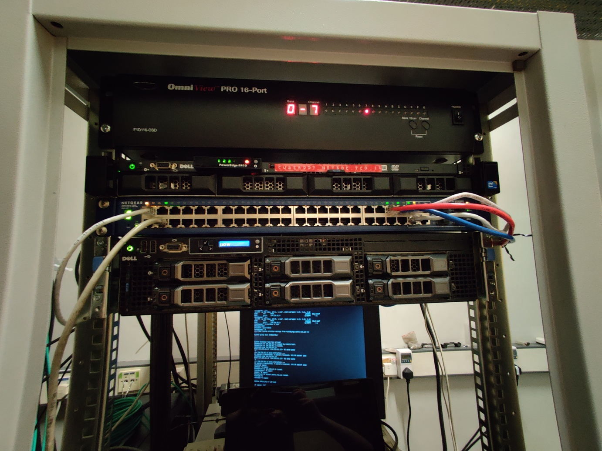

# Network

## Architecture

Netsoc uses three subnets (provisionally):

- `10.69.0.0/16` (Netsoc private LAN)
- `10.42.0.0/24` (Netsoc private VPN)
- `134.226.0.0/16` (TCD main allocation, Netsoc is permitted _only_ to use
  `134.226.83.3-254`)
- `192.168.69.0/24` (Maths server room management network)

... more details to come on public networking situation

## IP address allocation

- `192.168.69.1`: Maths room boot server
- `192.168.69.10`: `nintendo` (maths room switch)

- `10.16.0.1`: Maths room boot server
- `10.16.1.1`: `napalm`
- `10.16.1.2`: `spoon`
- `10.16.1.3`: `cube`
- `10.16.10.1`: `napalm-idrac`
- `10.16.10.3`: `cube-idrac`

!!! note
    LAN IP addresses are handed out over DHCP (IP addresses fixed in
    `dnsmasq.conf`)

## Maths server room

Netsoc has a switch (named `nintendo`) which handles all our traffic in the
maths department's server room. It is a Netgear GS748TS (48 port gigabit
managed), donated by `dev`.

### VLANs

In order to isolate traffic from each subnet (particularly the TCD public
network!), VLAN's are configured on `nintendo`.

- VLAN 1 (management)

    This VLAN exists just to configure `nintendo`. It's untagged on all ports
    (since it's the default VLAN) and the PVID on ports 1, 2, 47 and 48
    (leftmost 2 and rightmost 2 ports respectively).

- VLAN 69 (Netsoc private LAN)

    Untagged on all ports (except for management and TCD uplink 3, 4, 5 and 6),
    tagged on management ports. Also the PVID for all ports except management
    and TCD uplink ports.

- VLAN 420 (TCD public network)

    Untagged and PVID on ports 3, 4, 5, and 6 (for uplink to maths' switches).
    Tagged only on all others to avoid accidentally connecting to the public
    network!

*[PVID]: While a VLAN being untagged on a port tells the switch that a packet on that VLAN should be stripped of VLAN headers when going out on that port, the PVID sets the VLAN that should be assigned to packets coming into the port.
